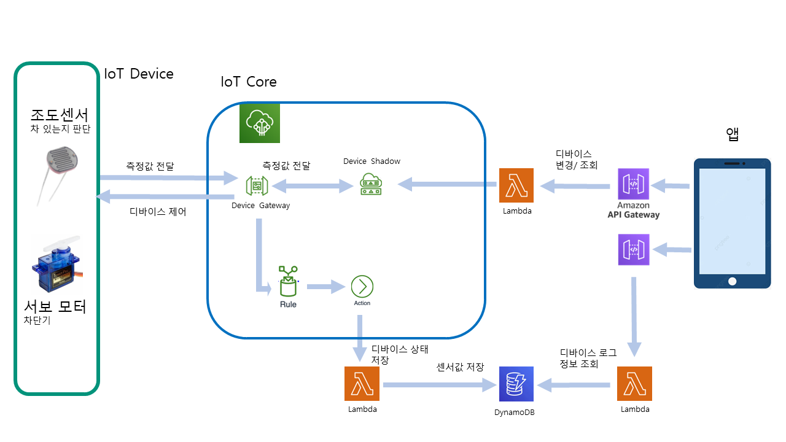

## REST API 기반 주차장 안드로이드 앱 
- **Parking Project** 안드로이드 프로젝트는 **Amazon API Gateway**를 통해서 게시된 REST API를 활용하여 **IoT 벡엔드**와 상호작용.
  ## 기능
  Arduino MKR WiFi 1010에 연결된 조도 센서를 이용해서 차의 유무를 감지한다. 차가 감지되면 차단기가 올라간 이후 시간 카운트가 올라가고 20초 전까지는 요금이 3000원이며 20초 이후론 1초당 1원씩 올라간다.

  Android App을 통해 실시간으로 차를 댄 시간과 요금을 조회할 수 있다.

  App내에서 결제버튼 클릭 시, 차단기가 내려간다.

  지정된 날짜 내 시간대와 요금 로그를 조회할 수 있다. 

 
  관리자가 차가 올때마다 상시로 체크하고 관리하기 번거로우므로, 주차장에 조도센서를 이용하여 차량의 유무와 주차시간 그로인한 요금을 자동으로 알 수 있도록 서비스를 설계했다.

  차량 유무를 확인하는 센서로 조도센서를 사용하면 야간에 어려울 것 같다는 문제를 떠올렸지만 지하주차장은 제한이 없고 실외 주차장이더라도 주차장 내 가로등이 있으니 문제없다는 판단을 내려 조도센서를 선택했다.

  조도센서로 차량이 있던 시간과 측정된 요금 값을 실시간으로 Android App을 통해 볼 수 있게 구현했다.

  App내에서 차가 나가기 위해 결제를 완료하면 관리자가 수동으로 차단기를 제어할 수 있게 하였다.

  추후, 쌓인 로그 데이터로 설정한 시간동안 몇대의 차가 이용했고 차마다 얼마의 요금을 냈는지 알 수 있도록 하였다.

  **요약**
   - 주차 목록 조회 
   - 주차 시간, 요금 조회, 결제
   - 요금 로그 조회

  


## 1. Arduino MKR WIFI 1010 관련 Library 설치

* WIFININA
* ArduinoBearSSL
* ArduinoECCX08
* ArduinoMqttClient
* Arduino Cloud Provider Examples

## 2. ECCX08SCR예제를 통해 인증서 만들기

1. Arduino 파일 -> 예제 -> ArduinoECCX08 -> Tools -> ECCX08CSR Click!

2. Serial Monitor를 연 후, 나머지 질문엔 입력 하지 않고 Enter키만 누르고, Common Name: 부분에 MyMKRWiFi1010 입력, Would you like to generate? 에는 Y 입력

3. 생성된 CSR을 csr.txt 파일로 저장

## 3. AWS IoT Core에서 사물 등록하기

1. 관리 -> 사물 -> 단일 사물 생성 -> 사물 이름은 MyMKRWiFi1010 입력 -> CSR을 통한 생성을 Click -> 2번에서 저장한 csr.txt를 Upload -> 사물 등록

* region은 아시아 태평양(서울) ap-northeast-2로 해줌./ 사물의 정책 AllowEverything(작업 필드 : iot.* 관련) 생성 후 연결해줌.

2. 보안 -> 관리에서 생성된 인증서도 정책(AllowEverything)을 연결 해줌.

3. 생성된 인증서를 다운로드

4. 다운로드 된 인증서 확인

## 4. Parking-Project-mainf/arduino_secrets.h

1. #define SECRET_SSID ""에 자신의 Wifi 이름을, #define SECRET_PASS ""에 Wifi의 비밀번호 기입.

2. #define SECRET_BROKER "xxxxxxxxxxxxxx.iot.xx-xxxx-x.amazonaws.com"에는 설정에서 확인한 자신의 엔드포인트를 넣는다.

3. const char SECRET_CERTIFICATE[] 부분에는 3에서 다운 받은 인증서 csr.txt를 복붙해준다.

* 올바르게 작성 후, 업로드를 하면 Serial Monitor에는 network와 MQTT broker에 connect된 문구가 뜰것이다.


## 5.  aws를 이용한 백엔드 구성

테이블 만들기 -> 테이블 이름 : DeviceData / 파티션 키: deviceId(데이터 유형 : 문자열)

정렬 키 추카 선택 -> time 입력(데이터 유형 : 번호 선택)

intelliJ와 docker 프로그램을 이용해 생성 & Upload

-아래의 링크대로 4가지의 api를 구축한다.
1. https://kwanulee.github.io/APIGateway/listDevicesApi.html (디바이스 목록 조회)
2. https://kwanulee.github.io/APIGateway/getDeviceApi.html (디바이스 상태 조회)
3. https://kwanulee.github.io/APIGateway/updateDeviceApi.html (디바이스 상태 변경)
4. https://kwanulee.github.io/APIGateway/getLogApi.html (디바이스 로그 조회)


##설명
##아두이노
수업시간에 실습했던 예제 코드에 아래의 코드를 추가해 센서에 따라 모터가 움직이도록 함
```javascript
#include <Servo.h>
Servo servo;
int time = 0; // 시간 추적 변수
int fee = 3000; // 요금 변수
int light; // 빛의 세기 저장 변수

void setup(){
	...
	servo.attach(8);
}
void loop(){
	...
	light = analogRead(A1);
	if (light < 900)	
  	{
		servo.write(-30);
    		time = 0;
    		fee = 3000;
  	}
 	else
  	{
    		time += 1;
    		if (time > 20)
    		{
      			fee += 1;
    		}
    		servo.write(30);
  	}

  	delay(1000);
	}
	...
}

void onMessageReceived(int messageSize)
{
	...
	JsonObject root = doc.as<JsonObject>();
  	JsonObject state = root["state"];

 	int receivedLight = state["light"];

  	// 받은 빛 값에 따라 동작
  	if (receivedLight == 0)
  	{
    		// 서보 모터를 움직임
    		servo.write(-30);
    		delay(10000);
  	}
}
```

조도센서로 측정한 값을 light 변수에 저장하고, 900보다 크면 time변수에 계속 1을 더하고 time이 20보다 커질 때부터 fee에 1씩 더하고 서보모터를 동작( 차단기 올림 ). 900보다 작으면 time과 fee를 초기화하고 서보모터를 동작( 차단기 내림 ).
섀도우 서비스의 "state"의 "light"의 값이  0일 경우, 서보모터 동작( 차단기 내림 )

##앱 설명
>> MainActivity.java
앱에서 url을 입력하지 않고도 조회할 수 있게끔 함
```javascript
public class MainActivity extends AppCompatActivity {
    final static String TAG = "AndroidAPITest";
    EditText listThingsURL, thingShadowURL, getLogsURL;

    @Override
    protected void onCreate(Bundle savedInstanceState) {
        super.onCreate(savedInstanceState);
        setContentView(R.layout.activity_main);

        // 사물 목록 조회 버튼 설정
        Button listThingsBtn = findViewById(R.id.listThingsBtn);
        listThingsBtn.setOnClickListener(new View.OnClickListener() {
            public void onClick(View v) {
                // API 호출을 위한 URL
                String urlstr = "https://vm3hfg6d37.execute-api.ap-northeast-2.amazonaws.com/prod/devices";
                Log.i(TAG, "listThingsURL=" + urlstr);

                // URL이 맞는건지 확인하고 ListThingsActivity로 전환
                if (urlstr == null || urlstr.equals("")) {
                    Toast.makeText(MainActivity.this, "사물목록 조회 API URI 입력이 필요합니다.", Toast.LENGTH_SHORT).show();
                    return;
                }
                Intent intent = new Intent(MainActivity.this, ListThingsActivity.class);
                intent.putExtra("listThingsURL", urlstr);
                startActivity(intent);
            }
        });
```

>> DeviceActivity.java
입력값대로 값을 바꾸는 버튼이 아닌 디바이스의  time, fee 변수를 초기화 시키도록 바꿈
```javascript
...
public class DeviceActivity extends AppCompatActivity {
	...
	// 업데이트 버튼 초기화
        Button updateBtn = findViewById(R.id.updateBtn);
        updateBtn.setOnClickListener(new View.OnClickListener() {
            @Override
            public void onClick(View view) {
                // 업데이트할 상태 정보를 생성
                JSONObject payload = new JSONObject();
                try {
                    JSONArray jsonArray = new JSONArray();

                    //"light" 태그 추가, 버튼 눌리면 light를 0으로 만듦
                    JSONObject tag1 = new JSONObject();
                    tag1.put("tagName", "light");
                    tag1.put("tagValue", 0);

                    jsonArray.put(tag1);
	...
}

*이외에도 변수나 화면 구성 요소등을 바꿨지만 전달에 지장이 없을 것 같아 생략했다.

##앱 구동
1. 목록 조회. 주차 구역마다 기기가 있다면 이 곳을 통해 어느 곳에 주차가 됐고, 어느 곳은 비어있는지 알 수 있다.


2. 시간, 요금 조회. 조회 시작을 누르면 시간과 요금이 5초마다 업데이트되고, 결제를 누르면 시간과 요금이 초기화, 차단기가 내려간다.


3. 로그 조회. 어느 시간에 얼마만큼의 요금이 나왔는지 알 수 있다. 영수증 역할

	
